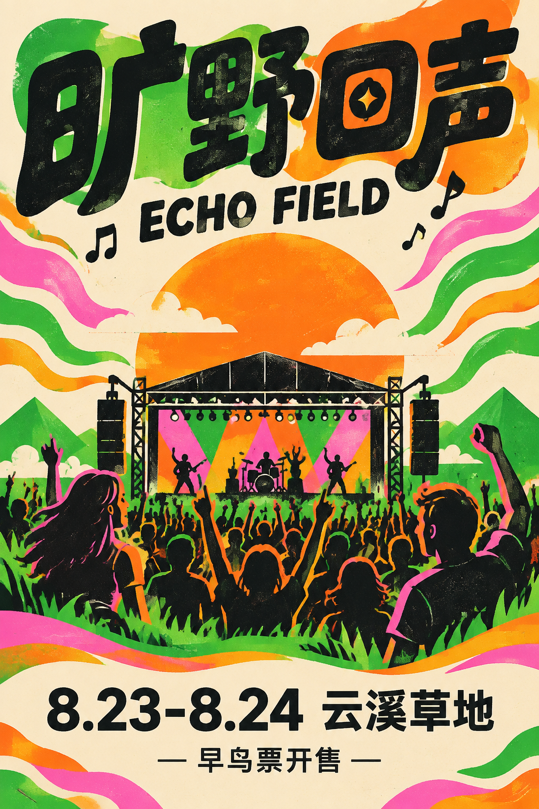
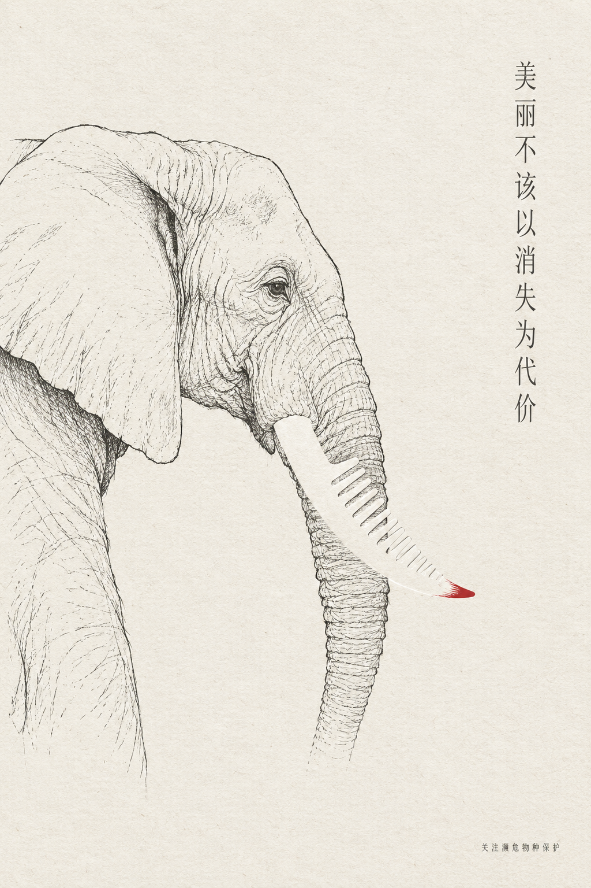
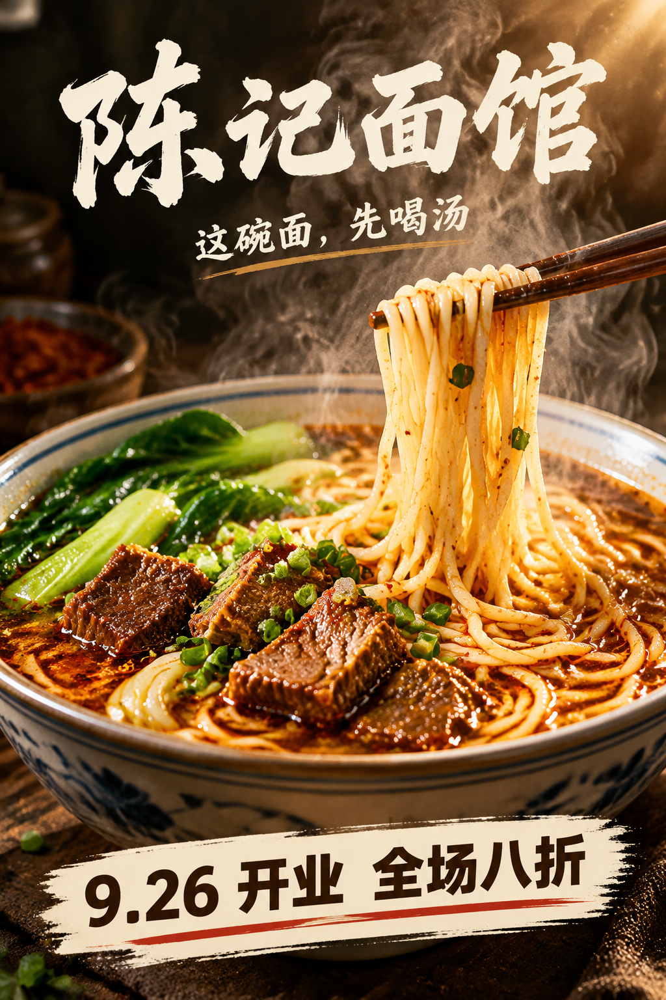

# xiaoma-designer

视觉表达设计方法论技能（Agent Skill）——把「想清楚 → 做规矩 → 有味道」的三层设计方法交给任何 AI Agent，让它在做海报、封面、KV、Banner 或评审设计时，先像策略师一样推演，再像设计师一样动手。

## 它解决什么问题

直接对 AI 说"给我画张海报"，得到的是视觉上的平均脸：华丽、工整、没有想法。
本 skill 让 Agent 在动笔前完成三层决策：

| 层 | 问题 | 内容 |
|---|---|---|
| 1. 策略 Strategy | 说什么，对谁说，凭什么在乎 | 通信模型、受众三问、修辞三角、马斯洛定位、故事钩子、差异化、K.I.S.S. |
| 2. 规范 Craft | 怎么用视觉元素说清楚 | 色彩 HSB、形状语言、字体层级、版面阅读顺序、格式塔、对比比例、文化安全 |
| 3. 表现 Style | 凭什么被记住 | 25+ 艺术流派风格词典、媒介质感、AI 味排除、人文底蕴检查 |

配套双工作流：

- **创建视觉作品**：策略推演 → 规范决策 → 风格选择 → 结构化提示词/排版稿 → 自审打分
- **评审打分**：三级成熟度评分（L1 不跑题 / L2 有规范 / L3 有表现）+ 分层诊断 + 改进清单

## 特性

- 🧠 **可解释**：每张图的颜色、字体、版式、风格都有决策依据，可复用可迭代
- 📚 **10 个场景案例（全部真实出图验证）**：文旅、活动、品牌、新品、公益、餐饮、播客、书籍、App 插画、节气借势，各带占位符提示词模板与成图评审
- 🔌 **生图模型无关**：不绑定任何生图服务——产出设计决策 + 结构化提示词 + 评审闭环，对接你自行接入的任何图像生成能力（本地或 API 均可）；需要精确版式时可让 Agent 另出 HTML/SVG
- 🌏 **中文友好**：中文排版的字重/对齐/竖排/文化色彩差异均有专门规则

## 案例图鉴

全部由同一套「策略 → 规范 → 风格 → 提示词」流程生成，点击文件名查看完整决策链：

<table>
  <tr>
    <td align="center" width="20%"><br><a href="examples/00-qingdao-tourism.md"><sub><b>00 城市文旅</b> · 复古旅行海报</sub></a></td>
    <td align="center" width="20%"><br><a href="examples/01-event-music-festival.md"><sub><b>01 音乐节活动</b> · 孟菲斯</sub></a></td>
    <td align="center" width="20%"><br><a href="examples/02-brand-campaign.md"><sub><b>02 品牌形象</b> · 极简主义</sub></a></td>
    <td align="center" width="20%"><br><a href="examples/03-product-launch.md"><sub><b>03 新品发布</b> · 瑞士国际主义</sub></a></td>
    <td align="center" width="20%"><br><a href="examples/04-public-welfare.md"><sub><b>04 公益倡导</b> · 负空间概念</sub></a></td>
  </tr>
  <tr>
    <td align="center"><br><a href="examples/05-food-beverage.md"><sub><b>05 餐饮美食</b> · 纪实烟火</sub></a></td>
    <td align="center"><br><a href="examples/06-podcast-cover.md"><sub><b>06 播客封面</b> · 概念极简</sub></a></td>
    <td align="center"><br><a href="examples/07-book-cover.md"><sub><b>07 书籍封面</b> · 超现实</sub></a></td>
    <td align="center"><br><a href="examples/08-app-illustration.md"><sub><b>08 App 插画</b> · 扁平</sub></a></td>
    <td align="center"><br><a href="examples/09-seasonal-festival.md"><sub><b>09 节气借势</b> · 水墨</sub></a></td>
  </tr>
</table>

## 安装

任意支持 Agent Skills 的运行时（Claude Code / pi / Codex / Cline 等）：

```bash
git clone https://github.com/<you>/xiaoma-designer.git
mkdir -p ~/.agents/skills
ln -s "$(pwd)/xiaoma-designer" ~/.agents/skills/xiaoma-designer
```

> `~/.agents/skills/` 是跨运行时通用目录；也可按运行时习惯放入 `~/.claude/skills/`、`~/.pi/agent/skills/` 等对应位置。

## 使用示例

安装后对 Agent 说：

- 「用 xiaoma-designer 给我的咖啡品牌做一张开业海报」
- 「按 xiaoma-designer 的评分表评审这张宣传图，给出改进清单」
- 「为"山野徒步"主题选一个合适的艺术风格，写出生图提示词」

## 目录结构

```
xiaoma-designer/
├── SKILL.md                      # 技能入口：三层方法论、双工作流、速查
├── references/
│   ├── strategy.md               # 策略层方法论
│   ├── design-rules.md           # 规范层：五元素决策表
│   ├── style-dictionary.md       # 表现层：艺术风格词典
│   └── review-rubric.md          # 评分表、高频扣分点、A/B 迭代法
├── examples/
│   ├── README.md                 # 10 场景案例索引 + 图鉴
│   ├── 00-qingdao-tourism.md     # ┐
│   ├── 01-event-music-festival.md│  │
│   ├── 02-brand-campaign.md      #  │  每个案例：
│   ├── 03-product-launch.md      #  │  策略推演 → 规范决策 → 风格选择
│   ├── 04-public-welfare.md      #  │  → 提示词模板 → 成图 → 评审
│   ├── 05-food-beverage.md       #  │
│   ├── 06-podcast-cover.md       #  │
│   ├── 07-book-cover.md          #  │
│   ├── 08-app-illustration.md    #  │
│   ├── 09-seasonal-festival.md   # ┘
│   └── *.png                     # 10 张真实出图
└── LICENSE                       # MIT
```

## 方法论来源

提炼自公开的经典设计通识：传播学模型、亚里士多德修辞学、马斯洛需求层次、格式塔心理学、现代设计史与美术史流派。不附带任何机构或课程材料。

## License

[MIT](LICENSE)
